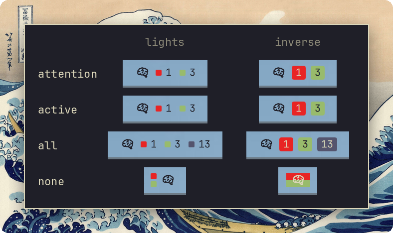

<!--
 ▄█████▄    ▄███████████▄   ▄███████   ▄██   ██▄  ▄████████  ▄███████▄  ▄███████▄  ▄███████▄
███   ███  ███   ███   ███  ███   ███  ███   ███  ███   ███  ███   ███  ███   ███  ███   ███
███   ███  ███   ███   ███  ███   ███  ███   ███  ███   ███  ███   ███  ███   ███  ███   ███
███   ███  ███   ███   ███  ███▄▄▄███  ███▄▄▄███  ███▄▄▄     ███▄▄▄██▀  ███   ███  ███▄▄▄██▀
███   ███  ███   ███   ███  ███▀▀▀███  ███▀▀▀███  ███▀▀▀     ███▀▀▀██▄  ███   ███  ███▀▀▀██▄
███   ███  ███   ███   ███  ███   ███  ███   ███  ███   ███  ███   ███  ███   ███  ███   ███
███   ███  ███   ███   ███  ███   ███  ███   ███  ███   ███  ███   ███  ███  ▄███  ███   ███
 ▀█████▀    ▀█   ███   █▀   ███   █▀    ▀█   █▀    ▀███████   ███   █▀  ▀███████▀   ███   █▀
-->

[herdr](https://herdr.dev) sessions, spaces, tabs and agents in the [Omarchy](https://omarchy.org) bar - with one keypress to jump to any of them.


## Install

```sh
omarchy plugin add https://github.com/njpatel/omaherdr.git --enable
omarchy restart shell
```

Nothing to configure. Omaherdr finds every `herdr` you are attached to from this desktop - plain, `--session NAME`, or `--remote HOST` - by looking at the processes in your terminal windows, then talks to each server over its socket (through `ssh HOST` for remote ones, which needs a key that works non-interactively and `python3` on the far side). A local server running with nobody attached is listed too.

## Use

The bar shows the icon with traffic lights: red for agents waiting for input, yellow for working, green for done, grey for idle (colours come from your theme). By default each lit state gets a light and its count (`attention` = red and green; `active` adds yellow; `all` adds grey); in icon-only mode the lit lights stack beside the icon. No lights means nothing needs you. Click the icon or the counts to open the panel.



| key | |
|---|---|
| `j` `k` | move |
| `/` | filter by space, tab, agent or status; `Esc` clears |
| `Enter` / click | jump: focuses the terminal window, then the space, tab or agent inside herdr |
| `v` | agents (most urgent first) / spaces (every space with its tabs) |
| `h` | redact names |
| `r` | cycle what the bar shows: attention, active, all, none |
| `l` | lights / inverse: a square beside each count, or the count on a pill of that colour (icon-only mode paints the colours behind the icon) |
| `i` | cycle the bar icon |
| `R` | refresh |

Status is live: the daemon subscribes to herdr's events, so the bar flips the moment an agent blocks on a question or finishes. `since` is how long the agent has been in its current state, as observed from here. Settings live on the bar entry: `omarchy bar set njpatel.omaherdr barMetric all` (or `barStyle`, `barIcon`, `view`, and `scanIntervalSec` for how often new or closed sessions are looked for, default 10).

## Terminals

A jump first focuses the window that hosts your herdr client, then the tab or pane inside it where the terminal allows.

| terminal | jump lands on | tested |
|---|---|---|
| kitty 0.48 | window, then the exact tab/pane (via kitty remote control, on by default in Omarchy) | yes |
| foot 1.27 | window (foot has no tabs) | yes |
| Alacritty 0.17 | window (no tabs) | yes |
| Ghostty 1.3 | window; when several windows share one process the one titled by herdr is chosen. Tabs cannot be driven from outside, so a herdr tab that is not the active one stays behind | yes |
| WezTerm 2024-02 | window, then the exact pane via `wezterm cli` | yes |

Anything else gets the window. Windows are matched from the client's process tree, so it works for `herdr`, `herdr --session`, and `herdr --remote` alike, in any terminal Hyprland can see. All five were tested on Omarchy with Hyprland 0.56: launch, discovery, and a jump from another workspace. If more than one terminal window is attached to the same server, the jump picks by herdr's window title, then the current workspace, then most recent focus; set `preferTerminal` (`omarchy bar set njpatel.omaherdr preferTerminal ghostty`) to always win with one terminal instead.

## How it works

`bin/omaherdr-daemon` scans processes every 10 s, maps each herdr client to its Hyprland window, and runs one `bin/omaherdr-helper` per server (shipped inline over ssh for remote hosts). The helper takes a `session.snapshot`, subscribes to workspace, tab, pane and per-pane agent-status events, and streams them back; the daemon folds everything into one JSON state per change, which `Widget.qml` renders. Jumps go the other way: `focuswindow` in Hyprland, then the terminal tab that hosts the client (kitty via its remote control, WezTerm via `wezterm cli`; foot and Alacritty have no tabs, so the window is enough; Ghostty and `foot --server` run every window from one process, so the window is picked by its herdr title), then `workspace.focus` / `tab.focus` / `pane.focus` on the right server.

## License

Apache-2.0
