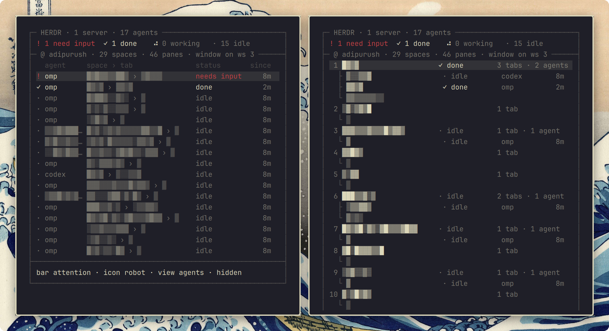

<pre>
 ▄█████▄    ▄███████████▄     ▄███████   ▄█   █▄    ▄███████   ▄███████▄    ▄███████▄    ▄███████▄
███   ███  ███   ███   ███   ███   ███  ███   ███  ███   ███  ███   ███    ███   ███   ███   ███
███   ███  ███   ███   ███   ███   ███  ███   ███  ███   ███  ███   ███    ███   ███   ███   ███
███   ███  ███   ███   ███  ▄███▄▄▄███  ███▄▄▄███  ███▄▄▄     ███▄▄▄██▀    ███   ███   ███▄▄▄██▀
███   ███  ███   ███   ███  ▀███▀▀▀███  ███▀▀▀███  ███▀▀▀     ███▀▀▀██▄    ███   ███   ███▀▀▀██▄
███   ███  ███   ███   ███   ███   ███  ███   ███  ███   ███  ███   ███    ███   ███   ███   ███
███   ███  ███   ███   ███   ███   ███  ███   ███  ███   ███  ███   ███    ███  ▄███   ███   ███
 ▀█████▀    ▀█   ███   █▀    ███   █▀    ▀█   █▀    ▀███████   ███   █▀    ▀███████▀    ███   █▀
</pre>

[herdr](https://herdr.dev) sessions, spaces, tabs and agents in the [Omarchy](https://omarchy.org) bar — with one keypress to jump to any of them.



## Install

```sh
omarchy plugin add https://github.com/njpatel/omaherdr.git --enable
omarchy restart shell
```

Nothing to configure. Omaherdr finds every `herdr` you are attached to from this desktop — plain, `--session NAME`, or `--remote HOST` — by looking at the processes in your terminal windows, then talks to each server over its socket (through `ssh HOST` for remote ones, which needs a key that works non-interactively and `python3` on the far side). A local server running with nobody attached is listed too.

## Use

The bar shows the icon, plus `!N` agents waiting for input and `✓N` agents that finished while you were elsewhere. Nothing beside the icon means nothing needs you. Click the icon or the counts to open the panel.

| key | |
|---|---|
| `j` `k` | move |
| `Enter` / click | jump: focuses the terminal window, then the space, tab or agent inside herdr |
| `v` | agents (most urgent first) / spaces (every space with its tabs) |
| `h` | redact names |
| `r` | cycle what the bar shows: attention, all, none |
| `i` | cycle the bar icon |
| `R` | refresh |

Status is live: the daemon subscribes to herdr's events, so the bar flips the moment an agent blocks on a question or finishes. `since` is how long the agent has been in its current state, as observed from here. Settings live on the bar entry: `omarchy bar set njpatel.omaherdr barMetric all` (or `barIcon`, `view`).

## How it works

`bin/omaherdr-daemon` scans processes every 5 s, maps each herdr client to its Hyprland window, and runs one `bin/omaherdr-helper` per server (shipped inline over ssh for remote hosts). The helper takes a `session.snapshot`, subscribes to workspace, tab, pane and per-pane agent-status events, and streams them back; the daemon folds everything into one JSON state per change, which `Widget.qml` renders. Jumps go the other way: `focuswindow` in Hyprland, then `workspace.focus` / `tab.focus` / `pane.focus` on the right server.

## License

Apache-2.0
